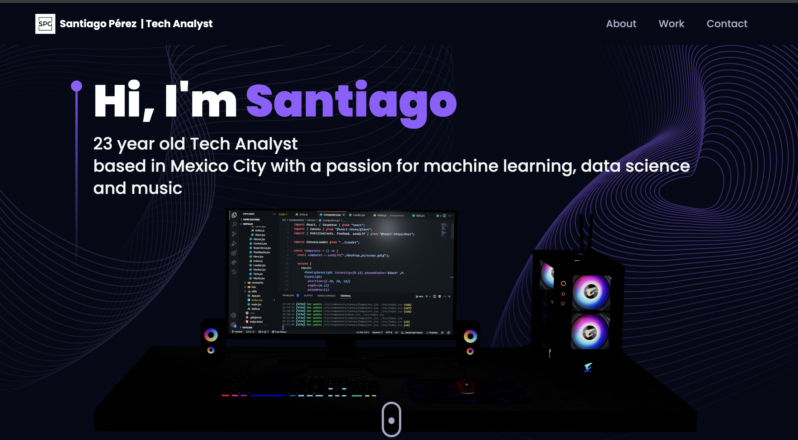

# Personal Portfolio

This is the repository for my personal portfolio, showcasing my skills and experience as a Tech Analyst. The project is built using React and various libraries for animations and 3D design.



## Technologies Used

- **React**: JavaScript library for building user interfaces.
- **Framer Motion**: Library for animations.
- **React Router**: For navigation between pages.
- **React Tilt**: For tilt effects on components.
- **React Vertical Timeline Component**: For displaying a vertical timeline.
- **Vite**: Fast build tool for frontend projects.

## Project Structure

- **src/components**: Contains all the React components used in the project.
  - **Hero.jsx**: Component for the introduction section.
  - **Navbar.jsx**: Component for the navigation bar.
  - **Experience.jsx**: Component for displaying work experience.
  - **Tech.jsx**: Component for displaying technologies I work with.
  - **About.jsx**: Component for the "About Me" section.
  - **Contact.jsx**: Component for the contact section.
  - **Feedbacks.jsx**: Component for displaying feedback.
  - **Works.jsx**: Component for displaying past projects.
  - **StarsCanvas.jsx**: Component for displaying an animated starry background.
- **src/constants**: Contains constant data used in the project.
- **src/hoc**: Contains higher-order components.
- **src/styles**: Contains CSS styles used in the project.
- **src/utils**: Contains utilities and helper functions.

## Installation

1. Clone the repository:
   ```bash
   git clone
   ```

2. Go to the root.
    ```bash
    cd repository name
    ```


## Contributions
Contributions are welcome. Feel free to open an issue or submit a pull request.

## License
This project is licensed under the MIT License. See the LICENSE file for details.

## Contact
You can contact me at: spg1824@gmail.com